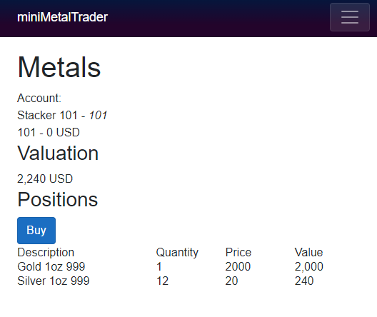

# miniMetalTrader
PWA to show demo of Custodian &amp; Order management of a metals account.

Sign-in (Can use Azure MSFT account in first iteration)

## Valuation
Holdings
Amount  Current Price$ Metal (AU AG etc.) Value (Amount*Price) Local FX (GBP / EUR / CAD / AUD)

Total USD / (GBP / EUR / CAD / AUD)

## Order Screen
Buy

Sell

Order Confirmation

Filled

## Transactions
Date  Amount/Qty  Price$ 

# Tech Stack
C# Blazor - Testing is InMemory Browser based store
Later Planned Items:
API Account and Order API
API integration with trading interface / transactional message queue etc.
Integration with miniAccounts 
Integration with miniCRM

First Cut of Blazor Pages

